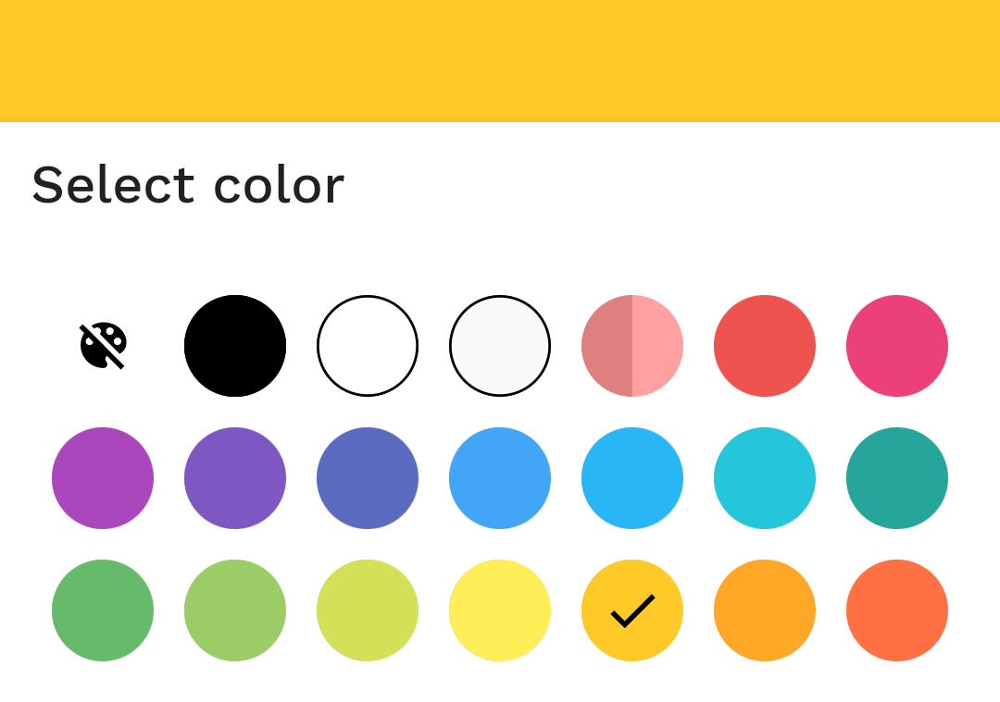
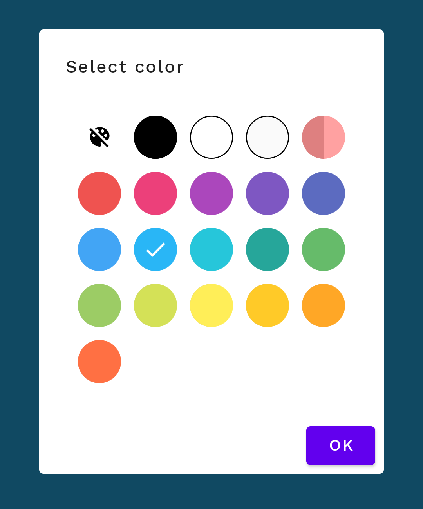

# Pigment

🎨 ColorPicker for Jetpack Compose

```gradle
dependencies {
    implementation 'com.sergiobelda.compose.colorpicker:colorpicker:1.0.0-dev04'
}
```

## Usage

```kotlin
val colors = listOf(
    Color(0xFFEF5350),
    Color(0xFFEC407A),
    Color(0xFFAB47BC)
)
val (selectedColor, onColorSelected) = remember { mutableStateOf(colors[0]) }

ColorPicker(
    colors,
    selectedColor,
    onColorSelected
)
```

## Screenshots

### BottomSheet



```kotlin
BottomSheetScaffold(
    sheetContent = {
        Column {
            Text(
                "Select color",
                style = MaterialTheme.typography.h6,
                modifier = Modifier.padding(12.dp)
            )
            Divider(thickness = 1.dp, color = MaterialTheme.colors.onPrimary)
            ColorPicker(
                colors,
                selectedColor,
                onColorSelected,
                modifier = Modifier.padding(12.dp)
            )
        }
    },
    scaffoldState = scaffoldState,
    sheetPeekHeight = 0.dp
) {
    ...
}
```

### Dialog



```kotlin
AlertDialog(
    onDismissRequest = { dialogState.value = false },
    title = {
        Text(
            "Select color",
            style = MaterialTheme.typography.body1
        )
    },
    text = {
        ColorPicker(
            colors,
            selectedColor,
            onColorSelected
        )
    },
    confirmButton = {
        Button(onClick = { dialogState.value = false }) {
            Text("OK")
        }
    }
)
```
